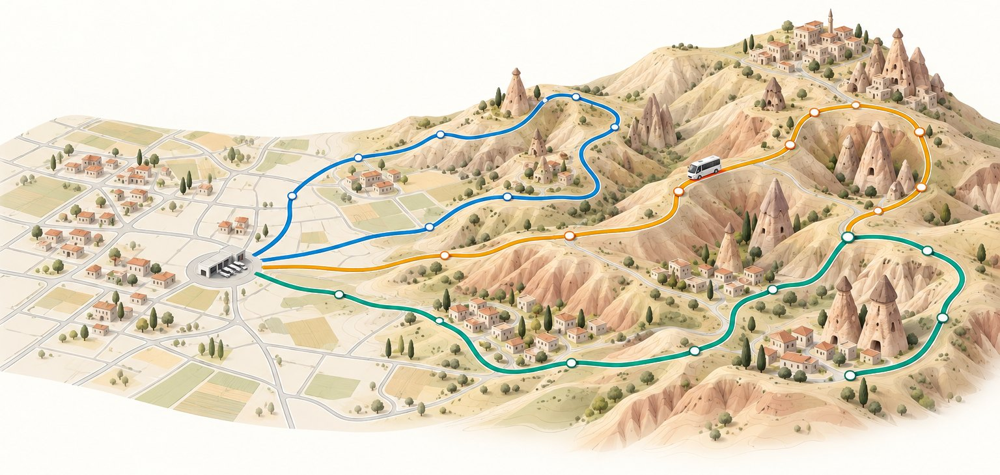
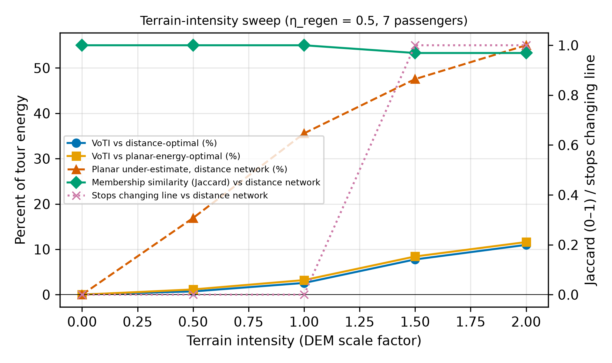
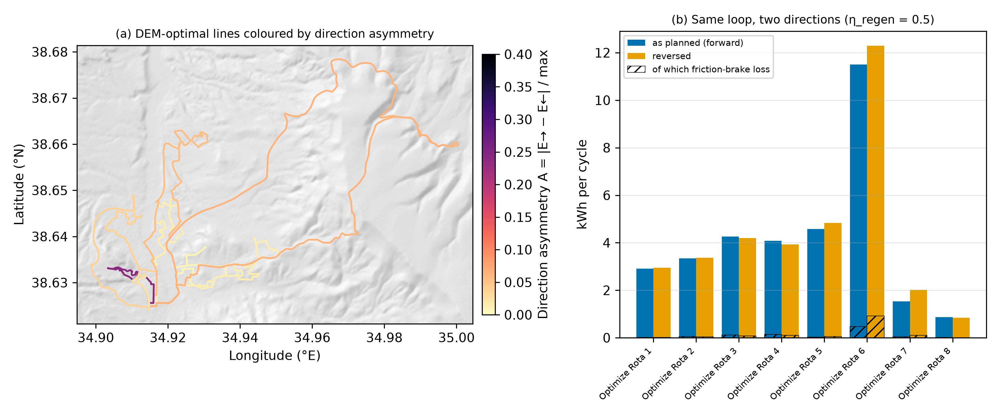

<p align="center"></p>

<p align="center">
  
</p>

<h1 align="center">Terrain Matters · Replication Package</h1>

<p align="center">
  <strong>Code, data and outputs of a study on energy-aware route design for electric fleets on real terrain</strong>
</p>

<p align="center">
  <b>English</b> · <a href="README.tr.md">Türkçe</a>
</p>

<p align="center">
  
  
  
  
  
  
</p>

---

This package holds the code, data and outputs of the article

> **Terrain Matters: Does Planar Routing Mislead Energy-Optimal Design of Electric Fleets? Evidence from a Hilly Town**
> Ahmet Ertuğrul Arık and M. Ali Ülkü. Manuscript in preparation for *Logistics* (MDPI).

The study runs on the real road graph, stop register and operated lines of the minibus (*dolmuş*) network of Ürgüp,
Türkiye. With this package a reader can check the energy model, rebuild the elevation grid, re-run every experiment and
redraw every figure and table of the article.

> [!NOTE]
> **Status (October 2026).** The manuscript is in preparation. The vehicle parameters in
> [`data/parameters/vehicle_profiles.json`](data/parameters/vehicle_profiles.json) are placeholders flagged
> `DOĞRULANACAK` ("to be verified"). The findings below are therefore described by direction and mechanism. Every
> absolute number will move once the parameters are sourced and the runs are repeated. The numbers themselves are in
> the run outputs and the R1 report. The DOI of the archived version will be added here.

---

## Contents

**Research**

- [Research question](#research-question)
- [Research questions and hypotheses](#research-questions-and-hypotheses)
- [Study area and data](#study-area-and-data)
- [Method](#method)
- [Metrics](#metrics)
- [Experiments](#experiments)
- [Preliminary findings](#preliminary-findings)
- [Scope and limitations](#scope-and-limitations)

**Replication**

- [Package contents](#package-contents)
- [Installation](#installation)
- [Check the energy model](#check-the-energy-model)
- [Build the elevation grid](#build-the-elevation-grid)
- [Re-run the experiments](#re-run-the-experiments)
- [Outputs](#outputs)
- [Figures and tables](#figures-and-tables)
- [Notes on reproducibility](#notes-on-reproducibility)
- [Data and licences](#data-and-licences)
- [Citation, authors and AI use](#citation-authors-and-ai-use)

---

# Research

## Research question

> **For an electric fleet, how much energy is lost when route design is done on a planar road network instead of
> on the three-dimensional surface, and does terrain information actually change the routing decisions?**

Fleet routes are almost always designed on a map: a graph of road segments with lengths and, at best, speeds. The
objective is distance, time or a cost proportional to one of them. This *planar* model knows where roads go, but not
how high they climb. For a diesel vehicle the omission is tolerable, because fuel spent on a hill cannot be recovered
on the way down. For an electric vehicle it is not. Regenerative braking recovers part of a descent's potential energy
with three limits:

- only a share of it (η<sub>regen</sub>);
- only up to the power the motor and battery can absorb (P<sup>max</sup><sub>regen</sub>);
- only when the descent is steep enough to overcome rolling resistance at all.

The energy a battery delivers over a closed tour is therefore not a function of distance, or even of total climb. It
depends on *where* the climbs and descents occur, in *which direction* they are taken and *how steep* they are.

The study separates two kinds of error:

| | Accounting error | Decision error |
|---|---|---|
| What goes wrong | The energy figure of a given route is wrong | The route that was chosen is wrong |
| Measured by | Planar estimation error, E<sub>planar</sub> / E<sub>DEM</sub> − 1 | Value of terrain information (**VoTI**) |
| Can it be fixed afterwards? | Yes, by re-evaluating the route on the terrain | No, because the routes have already been chosen |

**VoTI** is the extra energy a planar-optimal network spends on the real terrain, compared with a terrain-optimal
network for the same stops, vehicle and service:

```math
\mathrm{VoTI} = E_{DEM}(R_{\text{planar-opt}}) - E_{DEM}(R_{\text{DEM-opt}})
```

The study reports VoTI against both the planar-energy-optimal network and the distance-optimal network, because the
distance-optimal network is what practice actually uses.

## Research questions and hypotheses

| | Sub-question |
|---|---|
| RQ1 | How large is the accounting error between the planar and the three-dimensional energy of the same routes? |
| RQ2 | Do line memberships and visiting orders change when the objective is three-dimensional energy, and by how much? |
| RQ3 | How different in energy are the two directions of a closed loop that are identical in distance? |
| RQ4 | How do these effects scale with regeneration efficiency, vehicle mass and the intensity of the relief? |
| RQ5 | How sensitive are they to the vertical uncertainty of a 30 m DEM? |

| | Hypothesis |
|---|---|
| **H1** | The planar model underestimates tour energy systematically, and the underestimate grows as η<sub>regen</sub> falls. |
| **H2** | The loss is set by the distribution of grades rather than by total climb. The two directions of a loop are therefore identical in distance but not in energy, and the friction-brake share explains the difference. |
| **H3** | Above a threshold of terrain intensity, terrain information changes line membership; below it, only the accounting changes. |

## Study area and data

Ürgüp is a district centre of about 20,000 inhabitants in Cappadocia, central Anatolia. Its neighbourhoods sit on
slopes and ridges around a compact centre, and one line serves the village of Aksalur outside the town. The service is
passenger transport. The planning problem, however, is the depot-based, closed-tour vehicle routing problem of
distribution logistics. The town is used as a test bed because it combines real road geometry, really operated lines
and strong relief, a combination that is rare in published benchmarks.

| Item | What the study uses | In this package |
|---|---|---|
| Lines | 8 municipal minibus lines from one central terminal (the depot) | |
| Stops | Planning register of 130 stops (129 customer stops plus the depot), draft revision 135 | [`data/editable/network.json`](data/editable/network.json) |
| Road graph | Directed graph of 1,948 road features (revision 1,584; 4,321 directed edges). Derived from OpenStreetMap and completed with the municipality's MAKS street centrelines where OSM lacks side streets; one-way rules from municipal signage records, road classes partly from the municipal transport master plan | [`data/editable/road_network.geojson`](data/editable/road_network.geojson) |
| Speeds | Municipal value or a default by road class (50 / 45 / 40 / 30 / 20 / 15 km/h). These are legal or assumed speeds, not measured operating speeds | In the road graph |
| Elevation | Copernicus DEM GLO-30 (30 m spacing, LE90 below 4 m), sampled into a 345 × 403 grid covering 976–1,599 m; dataset `glo30-v1`, checksummed. A second DEM, JAXA AW3D30 (`aw3d30-v1`), is used in the revision experiments | Not redistributed; built by [`scripts/build_elevation.py`](scripts/build_elevation.py) |
| Lines operated today | Frozen, read-only reference layer of the 8 lines, digitised from the municipality's route drawings and stop register | [`data/processed/baseline/baseline_network.json`](data/processed/baseline/baseline_network.json) |
| Vehicle | 14-seat electric minibus class, with placeholder parameters (see [Scope and limitations](#scope-and-limitations)) | [`data/parameters/vehicle_profiles.json`](data/parameters/vehicle_profiles.json) |

Stops are attached to the graph by splitting the nearest road at the stop's projection. A stop more than 120 m from any
road is rejected rather than connected by a straight line. A stop pair without a directed path is reported as an error
(`road_graph_unreachable`) rather than filled with a great-circle distance.

<p align="center">
  
  <br><sub><b>Figure 1 of the manuscript.</b> The municipal road network and the stops of the planning register over Copernicus GLO-30.</sub>
</p>

## Method

The model lives in [`urgup_transport/energy.py`](urgup_transport/energy.py), which uses only the Python standard
library. The shortest paths and the optimiser are in [`urgup_transport/optimizer.py`](urgup_transport/optimizer.py).

### Segment energy model

Each directed road segment is resampled every **25 m**, and elevation is read at each sample by bilinear
interpolation of the grid. The interior samples are smoothed with a **100 m** moving average. The two end samples keep
the node's raw elevation, so that the rises of a segment add up exactly to its end-to-end rise. Grades are capped at
**|s| ≤ 0.20**, because the surface model reads cliff faces and roofs. The net force at the wheel on sub-segment *k* is

```math
F_k = m g C_{rr}\cos\theta_k + \tfrac{1}{2}\rho\, C_dA\, v^2 + m g \sin\theta_k
```

The battery energy is

```math
E_k = \begin{cases} P_k t_k / \eta_{drive}, & P_k \ge 0 \\ -\,\eta_{regen}\, \min(|P_k|, P^{max}_{regen})\, t_k, & P_k < 0 \end{cases}
```

where $P_k = F_k v$. An auxiliary load $P_{aux}\,t_k$ is added in both cases. Braking power above the regeneration cap
goes to the friction brakes and is tracked as $E^{fric}$, because it is the mechanism behind direction asymmetry.

On the *planar* surface every θ is 0 and nothing else changes, so the difference between the two surfaces is terrain
and terrain only. Four closed-tour identities are unit tests in [`tests/test_energy.py`](tests/test_energy.py):

1. On flat terrain the DEM and planar energies coincide.
2. A lossless vehicle spends nothing on any closed tour.
3. The two directions of a loop are equal for the lossless vehicle and differ otherwise.
4. A symmetric hill costs exactly (1/η<sub>drive</sub> − η<sub>regen</sub>)·m·g·H more than its planar counterpart
   when there is no rolling or aerodynamic resistance.

### Asymmetric energy matrix and exact shortest paths

With regeneration a segment's energy can be negative, and Dijkstra's algorithm needs non-negative weights. Following
Artmeier et al. (2010) and Sachenbacher et al. (2011), a node potential is used:

```math
\pi(n) = \eta_{regen}\, m g\, h(n), \qquad e'_{ij} = e_{ij} + \pi(i) - \pi(j) \ge 0
```

Along any path the corrections telescope, so Dijkstra on *e′* finds the least-energy path. The reported energy is
always the sum of the **true** segment energies along the path found, never the corrected distance. Where the grade cap
breaks the identity, a handful of edges is clipped to zero and counted. The option
`energy_options.exact_potentials=True` replaces the physics potential with Johnson potentials from a Bellman–Ford pass.
The resulting stop-to-stop `energy_matrix` (Wh) is strongly asymmetric: the two distances of a stop pair are equal, but
their energies are not. [`tests/test_energy_routing.py`](tests/test_energy_routing.py) checks the potential-corrected
paths against Bellman–Ford on the raw energies.

### Line design

Three matrices are built from the same graph: distance (m), travel time (s) and energy (Wh). One of them is the
objective, and the other two are carried along for constraints and reporting. Line design is a **closed-tour
multi-vehicle routing problem** with:

- a fixed fleet of eight lines, as today;
- a single depot;
- one mandatory visit per stop;
- a same-vehicle constraint that keeps each neighbourhood on one line, with small neighbourhoods folded into the
  nearest large one;
- a route-length balance term.

Passenger demand and vehicle capacity are **not** part of the model (see revision experiment E0). The solver is Google
OR-Tools: path-cheapest-arc construction, guided local search and a fixed time limit. Energy costs are rounded to whole
watt-hours and shifted by a constant when negative, which changes nothing because every solution visits every node once
with a fixed fleet. Within each line the visiting order is refined by exact search for eight stops or fewer, and
otherwise by 2-opt followed by or-opt for the asymmetric matrix.

### Optimise once, evaluate everywhere

Each line's realised geometry is stored with the speed of every road piece it uses (`metrics.routes[].edge_speeds`).
A solution can therefore be **re-driven on any surface without being routed again**. This is what makes the central
comparison exact. E<sub>DEM</sub>(planar-optimal network) is the planar solution's own geometry, stop order and path
choices, re-evaluated with the terrain switched on.

**Two rules the code keeps:**

- Elevation is never stored on a geometry (`flatten_to_2d`). It is derived from the pair (geometry, DEM version).
- Every derived figure carries `elevation_source`, `elevation_confidence` and `grade_uncertainty_percent`.

## Metrics

| Metric | Definition |
|---|---|
| Tour energy | E<sub>planar</sub>(R), E<sub>DEM</sub>(R): Wh per cycle of all lines, and per line |
| Planar estimation error | E<sub>planar</sub> / E<sub>DEM</sub> − 1 |
| VoTI | E<sub>DEM</sub>(planar-opt or distance-opt) − E<sub>DEM</sub>(DEM-opt), in Wh and as a share |
| Membership similarity | Mean Jaccard index of lines paired by the assignment that maximises shared stops, plus the number of stops that change line |
| Order similarity | Mean Kendall τ over the stops shared by paired lines |
| Direction asymmetry | A = \|E<sub>→</sub> − E<sub>←</sub>\| / max(E<sub>→</sub>, E<sub>←</sub>) for the same polyline driven backwards |
| Friction share | E<sup>fric</sup> / E<sub>DEM</sub> |
| Analytic penalty check | E<sub>DEM</sub> − E<sub>planar</sub> compared with (1/η<sub>drive</sub> − η<sub>regen</sub>)·m·g·Σclimb |
| Slope-length ratio | Σℓ′ / Σℓ − 1, the (small) effect of terrain on distance itself |
| Stop stability (Monte Carlo) | Share of repeats in which a stop stays on its modal line |

## Experiments

### Main run `2026-09-29-urgup`

The main run has 57 optimisations and 15 s of solver time per cell (5 s per Monte Carlo repeat). Its outputs are in
[`data/processed/experiments/2026-09-29-urgup/`](data/processed/experiments/2026-09-29-urgup/).

| Experiment | What it does | Serves |
|---|---|---|
| **A** | Objective (distance / planar energy / DEM energy) × η<sub>regen</sub> ∈ {0, 0.3, 0.5, 0.7} × mass {empty, 7, 14 passengers}. The distance network is optimised once, the planar network once per mass and the DEM network for every cell. Every solution is evaluated on both surfaces, in both directions. | H1, H3 |
| **B** | Every line of every A solution, and the 8 reference lines, driven as planned and reversed | H2 |
| **C** | Relief scaled about the depot elevation, h′ = h<sub>ref</sub> + λ(h − h<sub>ref</sub>), with λ ∈ {0, 0.5, 1, 1.5, 2} | H3 |
| **D** | 30 DEM-energy runs, each on its own perturbed grid (σ = 4 m, spatially correlated), evaluated on that grid and on the reference grid | RQ5 |
| **E** | The municipality's 8 lines as drawn, under all 12 (η<sub>regen</sub>, mass) scenarios | H1, H2 |
| **R** | Three identical repeats; balance weight 0; grade cap 0.15 / 0.20 / 0.30 | Sensitivity |

### Revision experiments `2026-10-R1`

These are robustness checks prepared for the review stage. The report is
[`docs/paper/revision_R1/REPORT.md`](docs/paper/revision_R1/REPORT.md), and every table in it is generated from the
CSV files. The outputs are in [`data/processed/experiments/2026-10-R1/`](data/processed/experiments/2026-10-R1/).

| Experiment | Question |
|---|---|
| **E0** | Which constraints does the model actually enforce? There is no vehicle-capacity constraint, and memberships are fixed by the neighbourhood rule. |
| **E1** | Solver robustness: 10 node-order seeds × time limits of 15 / 60 / 300 s, for distance and DEM energy |
| **E2** | The neighbourhood rule switched off, with cold and warm starts and a chained terrain-aware search |
| **E3** | DEM noise σ ∈ {1, 2, 2.5, 4} m × two correlation lengths (about 90 m and about 300 m) × 30 repeats |
| **E4** | Exact shortest paths (Johnson / Bellman–Ford) against the clipped physics potential |
| **E5** | Delivery load that falls stop by stop along the line, with load-aware re-sequencing |
| **E6** | Is the reverse direction legal under one-way rules? Legal reverse routing is compared with physical reverse |
| **E7** | A second DEM (JAXA AW3D30) |

## Preliminary findings

These findings come from placeholder vehicle parameters. They are given by direction and mechanism only; the numbers
are in the run outputs (`experiments_summary.csv`, `network_metrics.csv`) and in the
[R1 report](docs/paper/revision_R1/REPORT.md).

**1. The planar model underestimates energy, for every network evaluated (H1 supported).** This holds for the
optimised networks and for the lines the municipality operates today. The underestimate grows as regeneration
efficiency falls and as mass rises. The mechanism is incomplete recovery of descents, and no recovery at all on
gentle ones, where the motor is still pulling. For the same reason the segment model's terrain penalty stays below the
simple analytic bound. Terrain has a negligible effect on distance itself.

**2. Terrain changes *how* a line is driven, not *which* line serves a stop.** Under the municipality's neighbourhood
rule, line membership is fixed by the rule itself (E0). The value of terrain information therefore comes from the
visiting order and from the road path between stops. The terrain-optimal network is slightly longer but climbs less,
and it keeps descents below the regeneration cap. VoTI stays positive across solver starts and time limits (E1), with
exact shortest paths (E4), on a second DEM (E7) and with a falling delivery load (E5).

**3. The decision value grows faster with relief than the accounting error does.** When the relief is scaled from flat
to twice Ürgüp's, the accounting error rises roughly linearly and saturates. VoTI rises roughly quadratically. A
membership change appears only at the high end of the sweep. H3 is supported for decisions and rejected for
membership on this network.

<p align="center">
  
  <br><sub><b>Figure 8 of the manuscript.</b> Terrain-intensity sweep. These are preliminary values from placeholder vehicle parameters.</sub>
</p>

**4. A better drivetrain makes the estimate less wrong but the decision more valuable.** Higher regeneration
efficiency shrinks the planar error. It enlarges the cap-limited asymmetry that a terrain-aware design can exploit.

**5. A closed loop has a cheap direction (H2 supported).** The two directions of a loop are equal in distance but not in
energy. The difference is concentrated on a few steep lines, and in the expensive direction more braking power goes to
the friction brakes. Today's lines follow the main roads at moderate grades and are nearly direction-neutral. One
caveat comes from E6: none of the lines can be driven backwards as it stands under one-way rules. A legally routed
reverse changes the asymmetry and has to be evaluated line by line.

**6. The DEM is the weak link for decisions, not for accounting.** With pessimistic, short-correlated noise at the
product's 90 % error bound, networks optimised on a noisy grid look better on that grid and worse on the true terrain.
E3 shows that the decision value survives smaller errors and errors that are correlated over longer distances. The
terrain-aware *estimate* is robust in every case.

**7. Without the neighbourhood rule, memberships do move (E2).** Independent heuristic runs are then dominated by search
noise. A terrain-aware search chained from the planar network still saves energy, by moving a handful of stops between
lines. Calling such changes "terrain-driven" needs a longer or exact search, and this remains an open question.

**What this means in practice.** The recommendation comes in order:

1. Put the elevation layer under the energy accounting first: battery sizing, range and charging plans.
2. Use it to choose the direction of every steep closed tour, within the one-way rules.
3. Let it change sequences and paths only where the relief is strong and the elevation data are better than a global
   surface model, and check the gain against a perturbed terrain before adopting it.

<p align="center">
  
  <br><sub><b>Figure 5 of the manuscript.</b> Direction asymmetry of the terrain-optimal lines, with the friction-brake loss hatched.</sub>
</p>

## Scope and limitations

- **Out of scope:** stop reduction, service frequency, headway, fleet size, passenger demand and vehicle capacity.
  Results are reported **per cycle** of each line, so no assumption on frequency is needed.
- **Vehicle parameters are placeholders** within the ranges reported for the class. The sweeps over η<sub>regen</sub>
  and mass let a reader locate a real vehicle in the results.
- Speed is the road's legal or default speed, constant along a segment. Acceleration is modelled only at stops, and
  coasting to stay under the regeneration cap is not modelled.
- The solver is a heuristic under a time limit, so "optimal" always means "best found".
- Today's lines are evaluated on the drawn geometry at 30 km/h. Four of the eight drawings are fragmentary chains.
- The physical reverse ignores one-way rules on purpose; E6 checks legality separately. Turn restrictions are not
  modelled.
- This is a case study of one town with two 30 m DEMs. The *shape* of the curves is the part expected to generalise.

---

# Replication

## Package contents

| Path | Content |
|---|---|
| [`urgup_transport/energy.py`](urgup_transport/energy.py) | Segment energy model: rolling, aerodynamic, grade and auxiliary load, with regeneration efficiency and power cap. Standard library only |
| [`urgup_transport/elevation.py`](urgup_transport/elevation.py) | Elevation read along a geometry from the grid, never stored on it |
| [`urgup_transport/optimizer.py`](urgup_transport/optimizer.py) | Distance, time and energy matrices (potential-corrected Dijkstra), OR-Tools routing, route realisation |
| `urgup_transport/…`, `webapp/optimization_service.py` | The store and helper modules the optimiser imports |
| [`scripts/run_terrain_experiments.py`](scripts/run_terrain_experiments.py) | Main run: experiments A–E and R |
| [`scripts/run_r1_revision_experiments.py`](scripts/run_r1_revision_experiments.py) | Revision experiments E0–E7, plus `report` and `figures` |
| [`scripts/plot_terrain_figures.py`](scripts/plot_terrain_figures.py) | Figures 1–9 from the run CSVs |
| [`scripts/build_elevation.py`](scripts/build_elevation.py) | Downloads Copernicus GLO-30 and builds the elevation grid |
| [`tests/`](tests/) | The four closed-tour identities of the energy model, and energy routing against Bellman–Ford |
| `data/editable/network.json` | Inputs: stop register, neighbourhoods and published lines (draft revision 135) |
| `data/editable/road_network.geojson` | Inputs: directed road graph (revision 1,584) |
| `data/processed/baseline/baseline_network.json` | Inputs: the 8 lines operated today, frozen |
| `data/parameters/vehicle_profiles.json` | Vehicle parameters (placeholders) |
| `data/processed/experiments/2026-09-29-urgup/` | Outputs of the main run |
| `data/processed/experiments/2026-10-R1/` | Outputs of the revision runs |
| `docs/paper/figures/`, `docs/paper/revision_R1/` | Figures and tables drawn from those outputs, and the R1 report |
| [`SOURCE.json`](SOURCE.json), [`SHA256SUMS`](SHA256SUMS) | Where the export came from, and a checksum of every file |

The code is exported from the authors' planning platform for the Municipality of Ürgüp, which is not public. The
package holds only what the experiments need, and the folder names are those the code expects.

## Installation

**Requirements.** Python 3.12 or later; the package is tested on 3.12.3 and 3.14.4. The published runs used
Python 3.14.4 on Linux, with OR-Tools pinned to `9.15.6755` in [`requirements.txt`](requirements.txt).

```bash
git clone https://github.com/elestirmen/terrain-matters.git
cd terrain-matters
python3 -m venv .venv
source .venv/bin/activate
pip install -r requirements.txt
```

> [!IMPORTANT]
> `DATABASE_URL` must **not** be set. Without it the code reads its inputs from `data/editable/`. To run on other
> files, the main-run script also takes `--draft`, `--roads` and `--reference`.

## Check the energy model

```bash
python -m unittest tests.test_energy tests.test_energy_routing
```

The tests take seconds. They check the four closed-tour identities of the model (see [Method](#segment-energy-model))
and that the potential-corrected shortest paths equal Bellman–Ford on the raw energies.

## Build the elevation grid

The grid is generated and ignored by git; its checksum is in every run manifest.

```bash
python scripts/build_elevation.py          # Copernicus GLO-30 → data/processed/elevation/glo30-v1/
```

The script downloads the two Copernicus GLO-30 tiles that cover the town. The run manifests record the sha256 of the
grid they used (`elevation.sha256` in `manifest.json`), and a rebuilt grid should match it. Experiment E7 fetches the
AW3D30 grid (`data/processed/elevation/aw3d30-v1/`) from the Microsoft Planetary Computer.

## Re-run the experiments

**1. Main run and figures.** 57 optimisations at 15 s each (5 s for the Monte Carlo repeats). Give it a new run id so
it does not resume the published one:

```bash
python scripts/run_terrain_experiments.py --run-id my-run --experiments A,B,C,D,E,R
python scripts/plot_terrain_figures.py --run-id my-run --out my-figures   # --dpi 600 for print
```

Compare `data/processed/experiments/my-run/network_metrics.csv` with the published
`2026-09-29-urgup/network_metrics.csv`. Before release, Experiment A (16 optimisations) was re-run from a clean
install of this package on Python 3.14 and took 5 min 21 s on a 4-core Intel N100. Every one of its 36 network rows
and 576 line rows matched the published run exactly, apart from the line ids generated for each run.

**2. Revision experiments.** About 3.5 hours of solver time in total; E1 alone takes about 1.7 hours. The script
resumes from stored cells, so move the published folder aside to compute rather than re-read:

```bash
mv data/processed/experiments/2026-10-R1 data/processed/experiments/2026-10-R1.published
python scripts/run_r1_revision_experiments.py E1      # E1 … E7, one at a time
python scripts/run_r1_revision_experiments.py report  # docs/paper/revision_R1/REPORT.md from the CSVs
python scripts/run_r1_revision_experiments.py figures # figR*.png from the CSVs
```

## Outputs

Every main run writes the following under `data/processed/experiments/<run_id>/`:

| File | Content |
|---|---|
| `manifest.json` | Run id, platform commit, DEM version and sha256, vehicle profile and its sha256, every parameter, timings |
| `proposals/<cell>.json` | Full optimiser proposal of each cell |
| `routes.geojson` | Every cell's line geometry, tagged by cell |
| `route_metrics.csv` | One row per (cell, evaluation scenario, line, direction) |
| `network_metrics.csv` | One row per (cell, evaluation scenario): totals, VoTI, Jaccard, τ |
| `reference_metrics.csv` | Experiment E: the municipality's lines as drawn |
| `monte_carlo.csv`, `stop_stability.csv` | Experiment D |
| `experiments_summary.csv` | Everything the figures are drawn from |

The revision runs write one folder per experiment (`2026-10-R1/E1/` … `E7/`), each with its own `manifest.json` and
CSV files. Re-running with the same `--run-id` reads finished cells and solves only the missing ones.

## Figures and tables

Every figure is drawn from the CSV files above by a script; no number is typed in by hand.

| Figure | File | Shows |
|---|---|---|
| 1 | [`fig01_terrain_network.png`](docs/paper/figures/fig01_terrain_network.png) | Road network and stops over Copernicus GLO-30 |
| 2 | [`fig02_route_profile.png`](docs/paper/figures/fig02_route_profile.png) | Elevation and grade along the steepest line of the DEM-optimal network |
| 3 | [`fig03_segment_energy.png`](docs/paper/figures/fig03_segment_energy.png) | Energy per directed road piece, and direction asymmetry of two-way pieces |
| 4 | [`fig04_penalty_vs_eta.png`](docs/paper/figures/fig04_penalty_vs_eta.png) | Planar underestimate, terrain penalty and VoTI against η<sub>regen</sub> (Experiment A) |
| 5 | [`fig05_asymmetry.png`](docs/paper/figures/fig05_asymmetry.png) | Direction asymmetry of the DEM-optimal lines (Experiment B) |
| 6 | [`fig06_reference_lines.png`](docs/paper/figures/fig06_reference_lines.png) | Today's eight lines: planar, DEM as drawn and DEM reversed (Experiment E) |
| 7 | [`fig07_networks.png`](docs/paper/figures/fig07_networks.png) | Planar-optimal and DEM-optimal networks: same stops, same solver, two surfaces |
| 8 | [`fig08_voti_vs_scale.png`](docs/paper/figures/fig08_voti_vs_scale.png) | Terrain-intensity sweep (Experiment C) |
| 9 | [`fig09_montecarlo.png`](docs/paper/figures/fig09_montecarlo.png) | VoTI, tour energy and membership stability under DEM noise (Experiment D) |

The R1 report, its tables (CSV) and figures `figR1`–`figR5` are in
[`docs/paper/revision_R1/`](docs/paper/revision_R1/).

## Notes on reproducibility

- **Inputs.** The inputs are the ones the published run was solved on. The draft revision was checked against the run
  manifest, and the road network against the digest every proposal records. [`SOURCE.json`](SOURCE.json) holds the
  result.
- **Solver.** OR-Tools returned identical networks on repeated runs of this instance. 15 s and 60 s limits gave the
  same networks, because guided local search stalls well before 15 s. Machine speed should therefore matter little,
  but a different OR-Tools version can change the search path.
- **Randomness.** Monte Carlo and node-order seeds are fixed in the scripts and recorded in every manifest.
- **Manifests.** Every run's `manifest.json` records the platform commit, the DEM checksum, the vehicle profile and its
  checksum, and every parameter.
- **Best found, not optimal.** The solver is a heuristic under a time limit, so a solution is "the best found", never
  "the optimum".
- **Integrity.** `sha256sum -c SHA256SUMS` checks every file of the package.

## Data and licences

| Part | Licence |
|---|---|
| Code | MIT ([`LICENSE`](LICENSE)) |
| Road geometry (`data/editable/road_network.geojson`, and `routes.geojson` and `proposals/*.json` of each run) | ODbL 1.0 ([`LICENSE-ODbL`](LICENSE-ODbL)), © OpenStreetMap contributors |
| Other data, tables and figures | CC BY 4.0 ([`LICENSE-DATA`](LICENSE-DATA)) |

The road graph is derived from OpenStreetMap and completed with street centrelines of the Municipality of Ürgüp. The
stops and the operated lines come from the municipality's open data. The elevation grids are not redistributed;
Copernicus DEM GLO-30 is © DLR e.V. and Airbus, provided under COPERNICUS by the European Union and ESA. Sources and
the required attribution notices are in [`ATTRIBUTION.md`](ATTRIBUTION.md).

## Citation, authors and AI use

Please cite the article; [`CITATION.cff`](CITATION.cff) has the details.

```bibtex
@unpublished{arik_ulku_terrain_matters,
  author = {Ar{\i}k, Ahmet Ertu{\u{g}}rul and {\"U}lk{\"u}, M. Ali},
  title  = {Terrain Matters: Does Planar Routing Mislead Energy-Optimal Design of
            Electric Fleets? Evidence from a Hilly Town},
  note   = {Manuscript in preparation for \emph{Logistics} (MDPI)},
  year   = {2026}
}
```

| Author | Affiliation | ORCID |
|---|---|---|
| **Ahmet Ertuğrul Arık** (first author) | Department of Information Systems and Technologies, Cappadocia University, Ürgüp, Nevşehir, Türkiye | [0000-0002-7952-4311](https://orcid.org/0000-0002-7952-4311) |
| **M. Ali Ülkü** (corresponding author) | Department of Management Science and Information Systems, and Centre for Research in Sustainable Supply Chain Analytics (CRSSCA), Faculty of Management, Dalhousie University, Halifax, Canada | [0000-0002-8495-3364](https://orcid.org/0000-0002-8495-3364) |

**Use of generative AI.** The energy model, the experiment runner and the figure scripts were implemented with Claude
Code (Anthropic) under the authors' design and review. The authors verified every equation, test and result. The
banner at the top of this page is a generated illustration and is not a figure of the manuscript. All figures and
tables of the manuscript are drawn from the experiment outputs.

**Acknowledgements.** The Municipality of Ürgüp provided the street centrelines, the stop register and the route
records.
