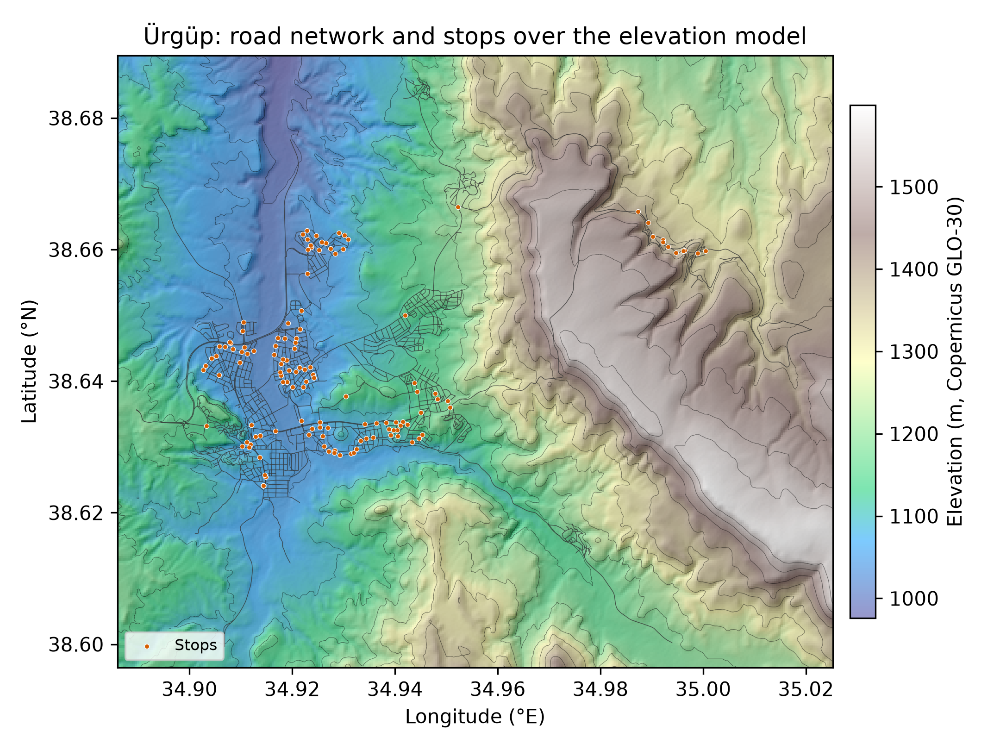

# Terrain Matters: replication package

**English** · [Türkçe](README.tr.md)

This package holds the code, data and outputs of the article

> **Terrain Matters: Does Planar Routing Mislead Energy-Optimal Design of Electric Fleets? Evidence from a Hilly Town**
> Ahmet Ertuğrul Arık and M. Ali Ülkü. Manuscript in preparation for *Logistics* (MDPI).

> [!NOTE]
> **Status.** The manuscript is in preparation. The vehicle parameters in `data/parameters/vehicle_profiles.json`
> are placeholders flagged `DOĞRULANACAK` ("to be verified"). Every absolute number will move once they are sourced
> and the runs are repeated. The DOI of the archived version will be added here.

<p align="center">
  
</p>

## The question

Fleet routes are designed on planar road networks, which know where roads go but not how high they climb. For an
electric vehicle this matters. Regenerative braking recovers only part of a descent's energy, only up to a power
limit, and nothing at all on gentle descents. The study asks how wrong the planar model is in two ways:

- **as an estimate:** the planar estimation error of a given route;
- **as a decision:** the *value of terrain information* (VoTI). VoTI is the extra energy, on the real terrain, that a
  planar-optimal network spends compared with a terrain-optimal network for the same stops and vehicle.

The case is the minibus network of Ürgüp, Türkiye: 8 lines, a directed road graph of 1,948 roads and relief from 976
to 1,599 m. Experiments sweep regeneration efficiency, vehicle mass, relief intensity and elevation noise.

## Contents

| Path | Content |
|---|---|
| `urgup_transport/energy.py` | Segment energy model: rolling, aerodynamic, grade and auxiliary load, with regeneration efficiency and power cap. Standard library only |
| `urgup_transport/elevation.py` | Elevation read along a geometry from the grid, never stored on it |
| `urgup_transport/optimizer.py` | Distance, time and energy matrices (potential-corrected Dijkstra), OR-Tools routing, route realisation |
| `urgup_transport/…`, `webapp/optimization_service.py` | The store and helper modules the optimiser imports |
| `scripts/run_terrain_experiments.py` | Main run: experiments A–E and R |
| `scripts/run_r1_revision_experiments.py` | Revision experiments E0–E7, plus `report` and `figures` |
| `scripts/plot_terrain_figures.py` | Figures 1–9 from the run CSVs |
| `scripts/build_elevation.py` | Downloads Copernicus GLO-30 and builds the elevation grid |
| `tests/` | The four closed-tour identities of the energy model, and energy routing against Bellman–Ford |
| `data/editable/network.json` | Inputs: stop register, neighbourhoods and published lines (draft revision 135) |
| `data/editable/road_network.geojson` | Inputs: directed road graph (revision 1,584) |
| `data/processed/baseline/baseline_network.json` | Inputs: the 8 lines operated today, frozen |
| `data/parameters/vehicle_profiles.json` | Vehicle parameters (placeholders) |
| `data/processed/experiments/2026-09-29-urgup/` | Outputs of the main run |
| `data/processed/experiments/2026-10-R1/` | Outputs of the revision runs |
| `docs/paper/figures/`, `docs/paper/revision_R1/` | Figures and tables drawn from those outputs, and the R1 report |
| `SOURCE.json`, `SHA256SUMS` | Where the export came from, and a checksum of every file |

The code is exported from the authors' planning platform for the Municipality of Ürgüp, which is not public. The
package holds only what the experiments need, and the folder names are those the code expects.

## Install

Python 3.12 or later; the package is tested on 3.12.3 and 3.14.4. The published runs used Python 3.14.4 on
Linux, with OR-Tools 9.15.6755.

```bash
git clone https://github.com/elestirmen/terrain-matters.git
cd terrain-matters
python3 -m venv .venv
source .venv/bin/activate
pip install -r requirements.txt
```

`DATABASE_URL` must **not** be set. Without it the code reads its inputs from `data/editable/`.

## Check the energy model

```bash
python -m unittest tests.test_energy tests.test_energy_routing
```

The tests take seconds. They check the four closed-tour identities of the model:

1. Flat terrain gives equal DEM and planar energy.
2. A lossless vehicle spends nothing on a closed tour.
3. The two directions of a loop are equal only without losses.
4. A symmetric hill costs (1/η<sub>drive</sub> − η<sub>regen</sub>)·m·g·H.

They also check that the potential-corrected shortest paths equal Bellman–Ford on the raw energies.

## Build the elevation grid

```bash
python scripts/build_elevation.py
```

The script downloads the two Copernicus GLO-30 tiles that cover the town and writes
`data/processed/elevation/glo30-v1/`. The run manifests record the sha256 of the grid they used
(`elevation.sha256` in `manifest.json`). A rebuilt grid should match it.

## Re-run the experiments

**Main run.** It has 57 optimisations at 15 s each (5 s for the Monte Carlo repeats). Give it a new run id so it does
not resume the published one:

```bash
python scripts/run_terrain_experiments.py --run-id my-run --experiments A,B,C,D,E,R
python scripts/plot_terrain_figures.py --run-id my-run --out my-figures
```

Compare `data/processed/experiments/my-run/network_metrics.csv` with the published
`2026-09-29-urgup/network_metrics.csv`. Before release, Experiment A (16 optimisations) was re-run from a clean
install of this package on Python 3.14 and took 5 min 21 s on a 4-core Intel N100. Every one of its 36 network rows
and 576 line rows matched the published run exactly, apart from the line ids generated for each run.

**Revision experiments.** They take about 3.5 hours of solver time in total; E1 alone takes about 1.7 hours. The
script resumes from stored cells, so move the published folder aside to compute rather than re-read:

```bash
mv data/processed/experiments/2026-10-R1 data/processed/experiments/2026-10-R1.published
python scripts/run_r1_revision_experiments.py E1      # E1 … E7, one at a time
python scripts/run_r1_revision_experiments.py report  # docs/paper/revision_R1/REPORT.md
python scripts/run_r1_revision_experiments.py figures
```

E7 downloads the AW3D30 tiles from the Microsoft Planetary Computer.

### Notes on reproducibility

- **Inputs.** The inputs are the ones the published run was solved on. The draft revision was checked against the run
  manifest, and the road network against the digest every proposal records. `SOURCE.json` holds the result.
- **Solver.** OR-Tools returned identical networks on repeated runs of this instance. 15 s and 60 s limits gave the
  same networks, because guided local search stalls well before 15 s. Machine speed should therefore matter little,
  but a different OR-Tools version can change the search path.
- **Randomness.** Monte Carlo and node-order seeds are fixed in the scripts and recorded in every manifest.
- **Manifests.** Every run's `manifest.json` records the platform commit, the DEM checksum, the vehicle profile and its
  checksum, and every parameter.
- **Best found, not optimal.** The solver is a heuristic under a time limit, so a solution is "the best found", never
  "the optimum".

## Data and licences

| Part | Licence |
|---|---|
| Code | MIT ([`LICENSE`](LICENSE)) |
| Road geometry (`data/editable/road_network.geojson`, and `routes.geojson` and `proposals/*.json` of each run) | ODbL 1.0 ([`LICENSE-ODbL`](LICENSE-ODbL)), © OpenStreetMap contributors |
| Other data, tables and figures | CC BY 4.0 ([`LICENSE-DATA`](LICENSE-DATA)) |

The road graph is derived from OpenStreetMap and completed with street centrelines of the Municipality of Ürgüp. The
stops and the operated lines come from the municipality's open data. The elevation grids are not redistributed. Sources
and the required attribution notices are in [`ATTRIBUTION.md`](ATTRIBUTION.md).

## Citation

Please cite the article; [`CITATION.cff`](CITATION.cff) has the details.

```bibtex
@unpublished{arik_ulku_terrain_matters,
  author = {Ar{\i}k, Ahmet Ertu{\u{g}}rul and {\"U}lk{\"u}, M. Ali},
  title  = {Terrain Matters: Does Planar Routing Mislead Energy-Optimal Design of
            Electric Fleets? Evidence from a Hilly Town},
  note   = {Manuscript in preparation for \emph{Logistics} (MDPI)},
  year   = {2026}
}
```

## Authors

| Author | Affiliation | ORCID |
|---|---|---|
| **Ahmet Ertuğrul Arık** | Department of Information Systems and Technologies, Cappadocia University, Ürgüp, Nevşehir, Türkiye | [0000-0002-7952-4311](https://orcid.org/0000-0002-7952-4311) |
| **M. Ali Ülkü** (corresponding author) | Department of Management Science and Information Systems, and Centre for Research in Sustainable Supply Chain Analytics (CRSSCA), Faculty of Management, Dalhousie University, Halifax, Canada | [0000-0002-8495-3364](https://orcid.org/0000-0002-8495-3364) |

**Use of generative AI.** The energy model, the experiment runner and the figure scripts were implemented with Claude
Code (Anthropic) under the authors' design and review. The authors verified every equation, test and result.

**Acknowledgements.** The Municipality of Ürgüp provided the street centrelines, the stop register and the route
records.
